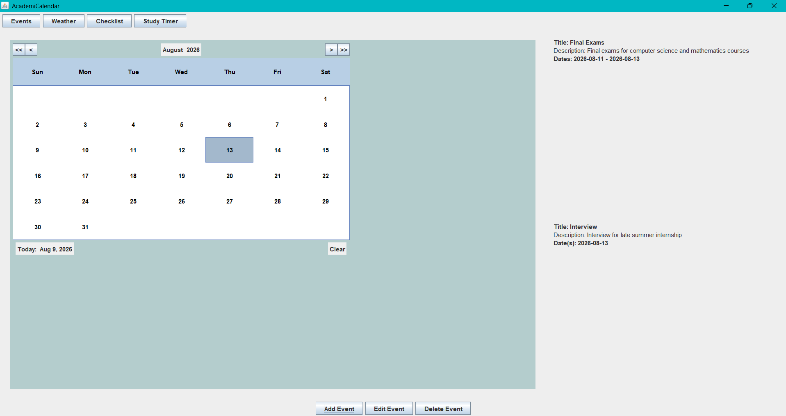
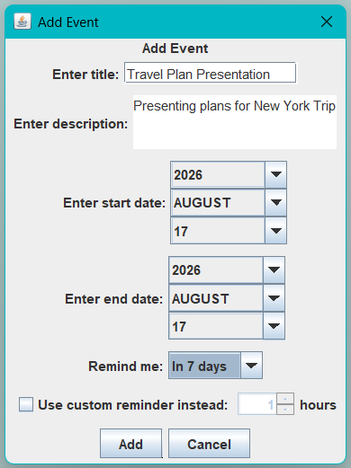
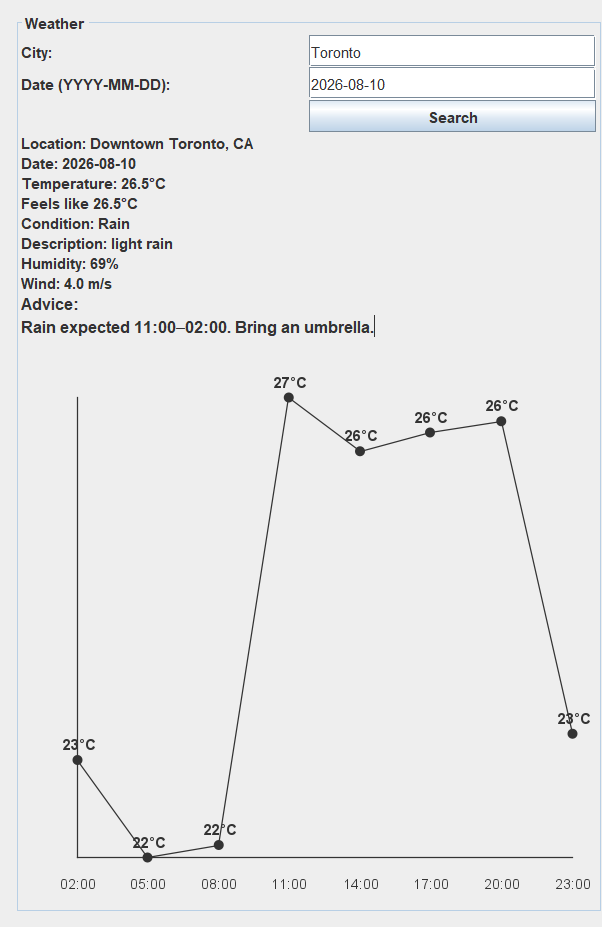
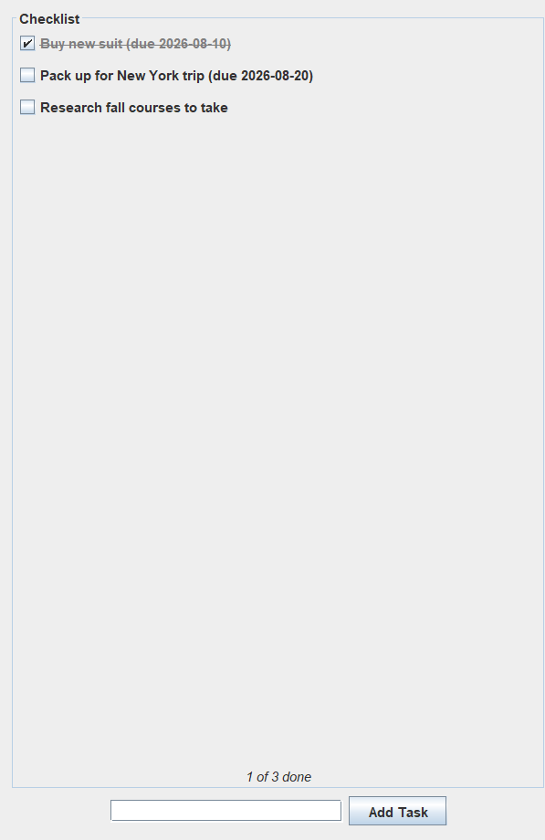
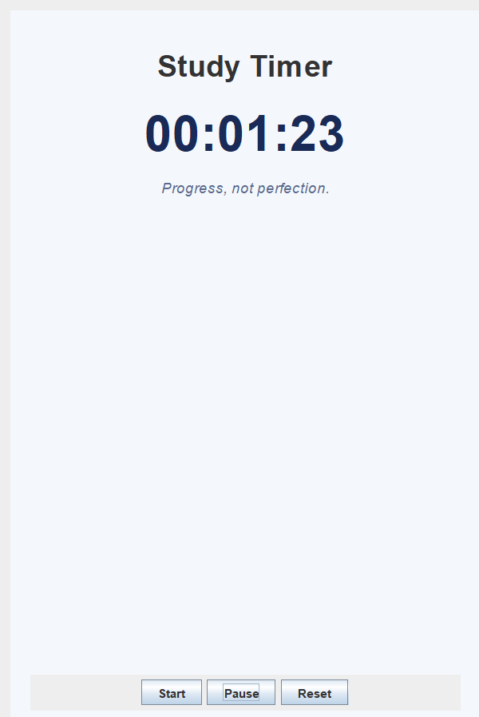

# AcademiCalendar

An all-in-one desktop calendar app for students to manage events, checklists, weather,
and reminders. 

## Authors & Contributors


- Yiting Jin
- Tran Truong
- Gurneel Alang
- Emma Hong

## Table of Contents

- [Summary](#summary)
- [Features](#features)
- [Installation](#installation)
- [Usage](#usage)
- [License](#license)
- [Feedback](#feedback)
- [Contributing](#contributing)

## Summary

AcademiCalendar helps people in academic spaces track deadlines and daily tasks in
one place, instead of juggling separate apps for events, to-do lists, and
weather. It combines a calendar, event manager, checklist, and weather view,
so students can plan their day without switching tools. Its diverse features 
are designed to work together as a single, cohesive planning tool, helping users
stay on top of their responsibilities with minimal friction.

## Features

- **Calendar** — Select dates on an interactive calendar.
- **Events** — Add, edit, and delete events tied to specified dates. Only applicable for the current year and the next.
- **Checklist** — Add tasks with an optional due date, check them off, and see completed tasks marked visually. Tasks are sorted by due date, and overdue tasks appear in red. 
- **Weather** — View weather information for a specified date and location via the OpenWeather API. Comes with advice to prepare for scheduled activities.
- **Reminders** — Get notified 1 hour, 3 hours, or 7 days before upcoming events. Also allows for custom reminder periods.
- **Timer** — Set a timer to track time spent studying or working.

*(Screenshots/GIFs of each view go here — capture the calendar, checklist,
and weather panels from a running build.)*






## API
The Weather feature uses theOpenWeather API to retrieve forecast data. The application uses two API endpoints:
Geocoding API
Converts the city entered by the user into latitude and longitude.
Geocoding API Documentation
5 Day / 3 Hour Forecast API
Retrieves weather forecast data using the latitude and longitude returned by the Geocoding API.
Forecast API Documentation


## Installation

**Requirements:** JDK 16+, Maven 3.8+, Git. Cross-platform (macOS, Windows,
Linux with a graphical desktop — Java Swing needs a display).

**Cloning the repository (via git):**
```bash
git clone https://github.com/Gurneel-Alang/AcademiCalendar.git
cd AcademiCalendar
export OPENWEATHER_API_KEY="your_key_here"   # get a free key at openweathermap.org/api
mvn clean install
```

**Run via IntelliJ IDEA:** Open the project, right-click
`src/main/java/app/CalendarPreviewMain.java` → **Run**. Make sure
`OPENWEATHER_API_KEY` is set in the run configuration's environment
variables (IntelliJ doesn't inherit shell variables automatically).

**Dependencies (auto-installed by Maven):** LGoodDatePicker `11.2.1`,
sqlite-jdbc `3.53.1.0`, org.json `20240303`, Gson `2.14.0`, JUnit `4.13.1`
(tests only).

**Common issue:** If the build fails with "cannot find symbol" for classes
like `EventDataAccessObject` or `CalendarView`, run `git pull origin main`
— you're likely on a stale checkout.

**Getting and setting up an API key:**
openweatherAPI key under configurations for CalendarPreviewMain
1. Go to https://openweathermap.org/ and sign up for free.
2. Verify your account via email.
3. Go to "API keys" and copy the free key given. The name associated with it should be "Default". If not present, generate a new key with a custom name.
4. On IntelliJ, go to `Main Menu → Run → Edit Configurations → Select CalendarPreviewMain` and paste `OPENWEATHER_API_KEY=YOUR_KEY` into `Environment variables`. Here, `YOUR_KEY` is the API key acquired.
5. Click `Apply` and then `OK`.

## Usage

1. Launch the app — the calendar view opens by default.
2. Click a date to select it.
3. Use the **Events**, **Weather**, and **Checklist** buttons to switch
   views.
4. In the Checklist view, type a task and click **Add Task** (or press
   Enter) to add it for the selected date. Click a task's checkbox to mark
   it complete.
5. Use **Add Event** / **Edit Event** / **Delete Event** to manage events
   on the selected date.

### Note on weather viewing:

The selected date is interpreted as the local date of the searched city. For
example, Beijing may already be one calendar day ahead of Toronto.

Weather information is available only for dates covered by the OpenWeather
forecast service.

Successful searches are cached locally in SQLite for offline access:

- macOS/Linux: `~/.academicalendar/weather.db`
- Windows: `%USERPROFILE%\.academicalendar\weather.db`

The database is created automatically. Weather data must be fetched online at
least once before it becomes available offline. Fresh cached results are reused
for up to three hours. If the API or network is unavailable, the application
will display an older cached result when one exists for the same city and date.


## Feedback and Suggestions
Open a [GitHub Issue](https://github.com/Gurneel-Alang/AcademiCalendar/issues)
describing the bug or suggestion.

## Contributing

This is a course project — contributions from outside the team are
currently closed. For team members:

1. Fork, or branch from `main`.
2. Make changes on a feature branch (`feature/your-feature-name`).
3. Open a pull request into `main` with a clear description of the change.
4. At least one other team member reviews and approves before merging.
